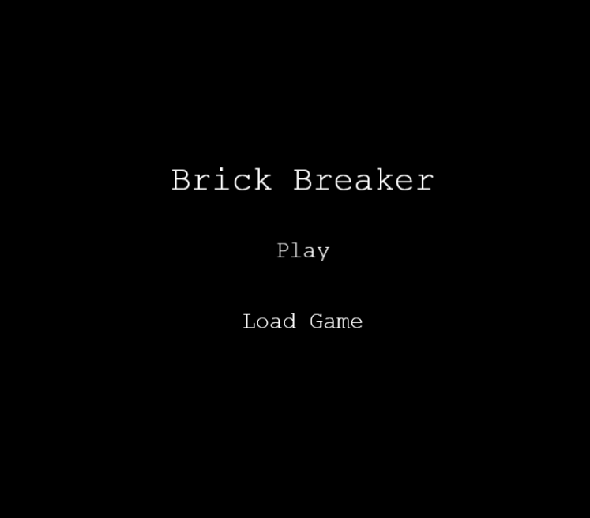
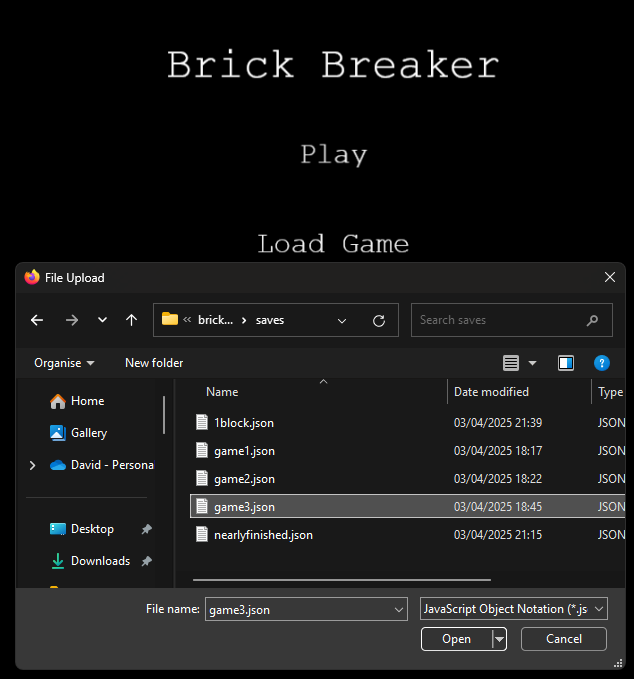
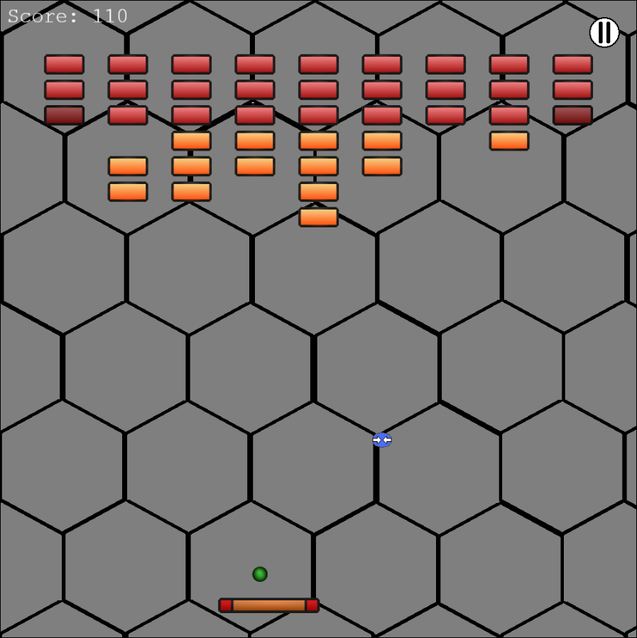
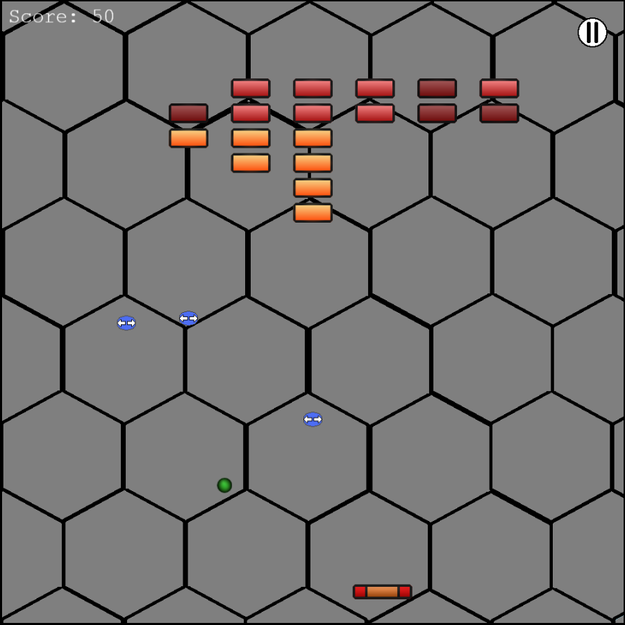
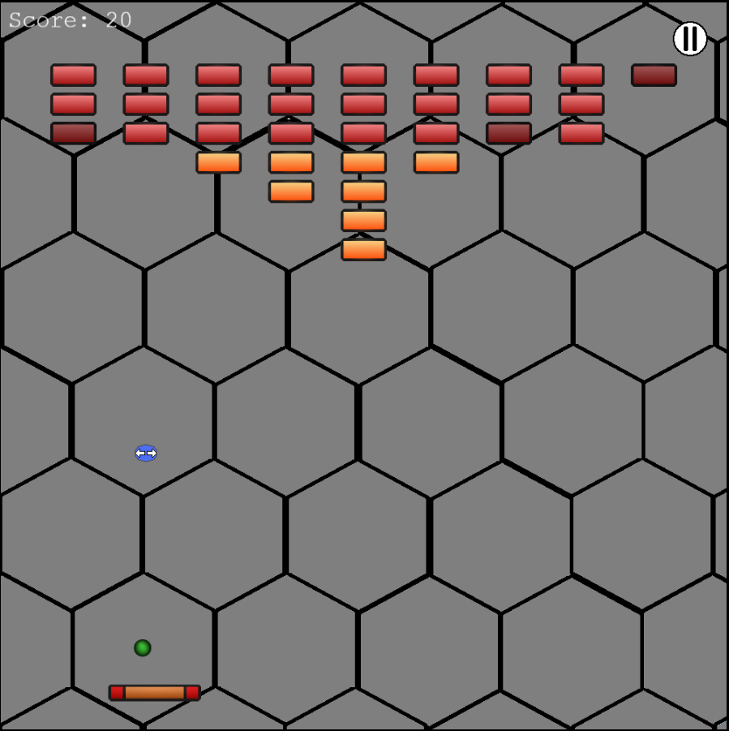
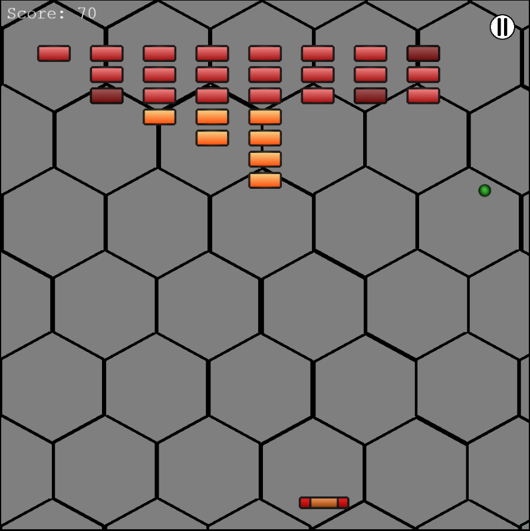

# 🕹️ Brick Breaker Game

A simple yet fun brick breaker game built using HTML, CSS, and JavaScript. Break all the bricks, collect power-ups, and challenge yourself with increasing difficulty!

---

## 🚀 Features  
✔️ Paddle movement using arrow keys  
✔️ Ball physics with bouncing mechanics  
✔️ Bricks with different durability levels  
✔️ Power-ups for extra abilities  
✔️ Score tracking  
✔️ Pause and resume functionality  

---

## 📷 Screenshots  



Ability to play a new game or load game from a JSON file




Use paddle to hit ball and break breaks - Red bricks take two hits.


Power-Ups also spawn and up your score but change ur paddle size.


The Expand Power-Up lengthens your paddle


The Shrink Power-Up shortens your paddle

---

## 🎮 How to Play  
1. Move the paddle left and right using the arrow keys.  
2. Hit the ball to break bricks.  
3. Some bricks take multiple hits to break.  
4. Collect power-ups for extra abilities and an increase to your score.
5. Try to clear all bricks and get the highest score!  

---

## 🛠 Installation & Setup  
1. Clone the repository:  
   ```bash
   git clone https://github.com/yourusername/brick-breaker.git
   cd brick-breaker

2. Open index.html in a browser.

3. Enjoy the game!

---

## References:

Tutorial for 2D Phaser Game: https://www.youtube.com/watch?v=0qtg-9M3peI

Phaser Documentation: https://docs.phaser.io/phaser/getting-started/what-is-phaser

Arkanoid Sprite Pack by Zealex: https://opengameart.org/content/basic-arkanoid-pack